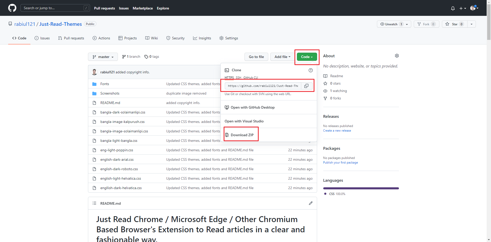
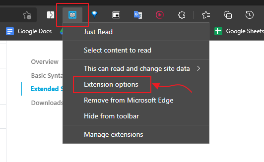
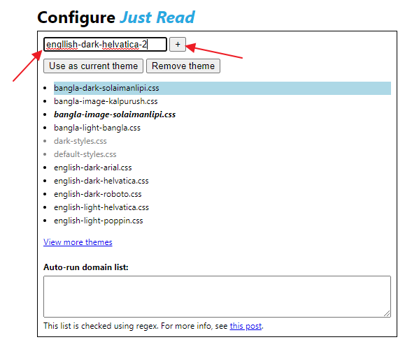
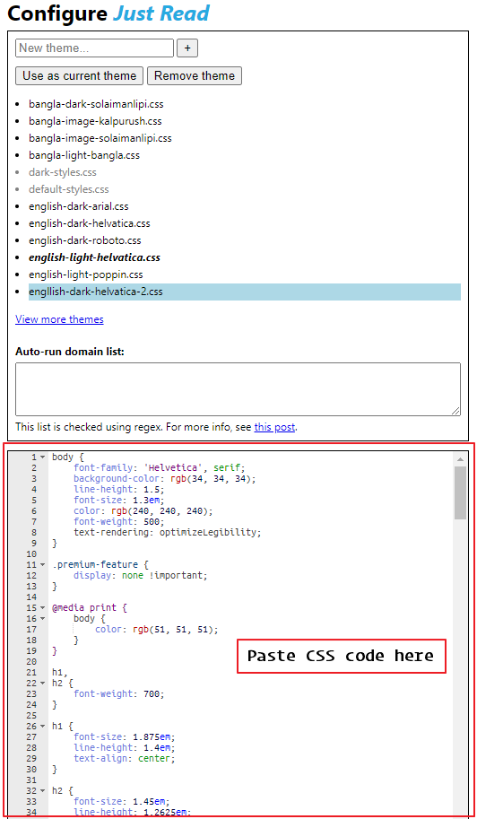
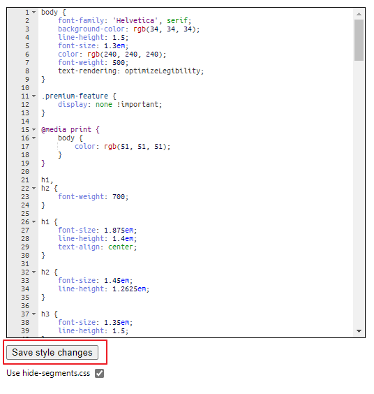

# Just Read Chrome / Microsoft Edge / Other Chromium Based Browser's Extension to Read articles in a clear and fashionable way.
## I have made some awesome customization in this CSS stylesheet to make your reading more smooth and healthy for your eyes.

## How to install:

### Step 1:
- Clone/download this repository.

- Open your browser and install **Just Read** Extension from this link (You can also search in google, lol): **[Just Read](https://chrome.google.com/webstore/detail/just-read/dgmanlpmmkibanfdgjocnabmcaclkmod)**

### Step 2:
Install fonts from the **Fonts** folder.

### Step 3:
Open **Just Read** extension option.

### Step3:
Add a new theme and paste the css code in the box and save.

### Step 4:
Open an article and click **Just Read** extension option to open reading mode.

## Copyright

@Md. Rabiul Islam

**Contact:**

- **Email :** <rabiul15@cse.pstu.ac.bd>

- **Facebook :** <https://fb.com/Robiul121>
